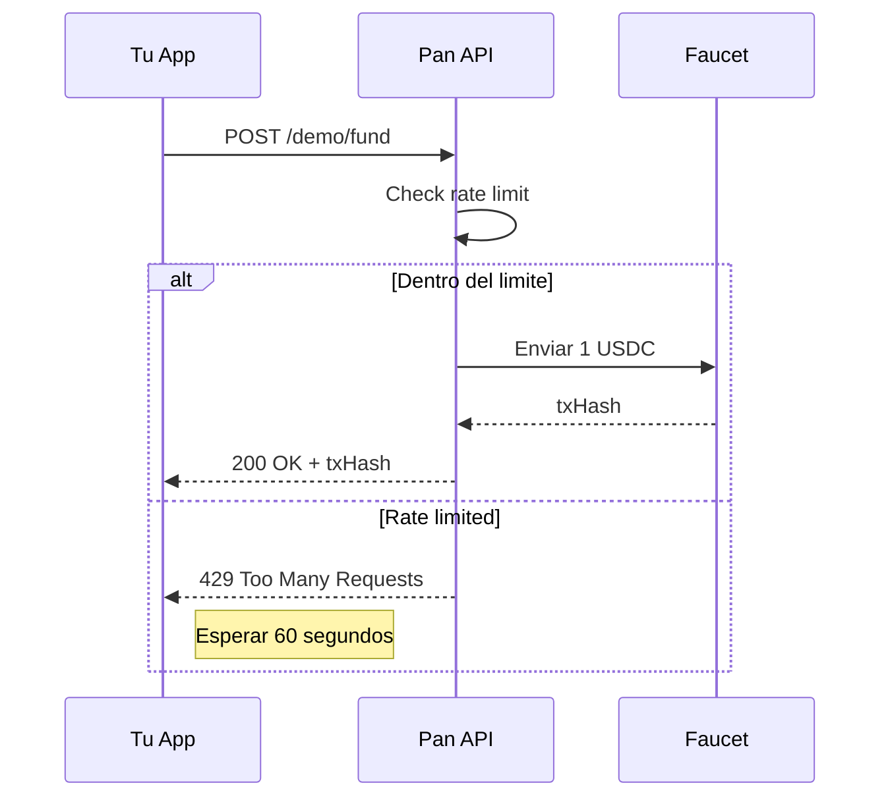

Fondea una wallet con tokens de testnet para pruebas.

<Warning>
  Solo funciona en testnet. No disponible en produccion.
</Warning>

## Endpoint

```
POST https://api.pan.dev/v1/demo/fund
```

## Autenticacion

API Key

## Request

```json
{
  "walletId": "pan_wallet_abc123"
}
```

### Parametros

| Campo | Tipo | Requerido | Descripcion |
|-------|------|-----------|-------------|
| `walletId` | string | Si | ID de la wallet Pan |

<Info>
  La cantidad y chain son fijos: **1 USDC** en **arbitrum-sepolia**. Esto es para evitar abuso del faucet.
</Info>

## Response

### 200 OK

```json
{
  "success": true,
  "walletId": "pan_wallet_abc123",
  "amount": 1,
  "chain": "arbitrum-sepolia",
  "asset": "USDC",
  "txHash": "0x123abc...",
  "explorerUrl": "https://sepolia.arbiscan.io/tx/0x123abc..."
}
```

### Campos de Respuesta

| Campo | Tipo | Descripcion |
|-------|------|-------------|
| `success` | boolean | Siempre `true` si exitoso |
| `walletId` | string | ID de la wallet fondeada |
| `amount` | number | Cantidad enviada (1 USDC) |
| `chain` | string | Chain usada (arbitrum-sepolia) |
| `asset` | string | Token enviado (USDC) |
| `txHash` | string | Hash de la transaccion |
| `explorerUrl` | string | Link al block explorer |

### Errores

| Codigo | Error | Descripcion |
|--------|-------|-------------|
| 401 | UNAUTHORIZED | API key invalida |
| 404 | WALLET_NOT_FOUND | Wallet no existe |
| 429 | RATE_LIMITED | Espera 60 segundos entre requests |
| 500 | FUNDING_FAILED | Error al enviar fondos |

## Ejemplos

<CodeGroup>
```bash cURL
curl -X POST https://api.pan.dev/v1/demo/fund \
  -H "Authorization: Bearer $PAN_API_KEY" \
  -H "Content-Type: application/json" \
  -d '{
    "walletId": "pan_wallet_abc123"
  }'
```

```javascript JavaScript
const response = await fetch('https://api.pan.dev/v1/demo/fund', {
  method: 'POST',
  headers: {
    'Authorization': `Bearer ${process.env.PAN_API_KEY}`,
    'Content-Type': 'application/json'
  },
  body: JSON.stringify({
    walletId: 'pan_wallet_abc123'
  })
});

const result = await response.json();
console.log('TX:', result.txHash);
console.log('Explorer:', result.explorerUrl);
```
</CodeGroup>

## Rate Limiting



## Notas

- **Rate limit**: 1 request por wallet cada **60 segundos**
- **Cantidad fija**: 1 USDC por request
- **Chain fija**: arbitrum-sepolia
- **Solo desarrollo**: No disponible en produccion
- Los fondos llegan casi instantaneamente (~10-30 segundos)
