## Caso de Uso

Una plataforma DeFi quiere:
- Permitir depositos desde cualquier chain
- Consolidar fondos automaticamente
- Ejecutar estrategias cross-chain

## Entendiendo Multi-Chain

```mermaid
flowchart LR
    subgraph Before["Sin Pan ❌"]
        direction TB
        B1["Aprobar tokens"]
        B2["Configurar bridge"]
        B3["Esperar finalizacion"]
        B4["Verificar balance"]
        B5["Aprobar para Aave"]
        B6["Depositar"]
        B1 --> B2 --> B3 --> B4 --> B5 --> B6
    end

    subgraph After["Con Pan ✓"]
        A1["pan.lend()"]
        A2["Completado!"]
        A1 --> A2
    end

    Before -.->|"100+ lineas de codigo"| After
    After -.->|"1 linea de codigo"| After

    style Before fill:#ffebee,stroke:#c62828
    style After fill:#e8f5e9,stroke:#2e7d32
```



### El Problema

Sin Pan, mover fondos entre chains requiere:

```typescript
// SIN PAN - Codigo complejo
async function depositFromArbitrum(amount: number) {
  // 1. Aprobar tokens en Arbitrum
  const approval = await arbitrumUSDC.approve(bridgeAddress, amount);
  await approval.wait();

  // 2. Iniciar bridge a Ethereum
  const bridgeTx = await bridge.deposit({
    token: USDC_ARBITRUM,
    amount,
    destinationChain: 'ethereum',
    recipient: myAddress
  });
  await bridgeTx.wait();

  // 3. Esperar finalizacion del bridge (puede tomar horas)
  await waitForBridgeCompletion(bridgeTx.hash);

  // 4. Verificar balance en Ethereum
  const balance = await ethereumUSDC.balanceOf(myAddress);

  // 5. Aprobar tokens para Aave
  const aaveApproval = await ethereumUSDC.approve(aavePool, balance);
  await aaveApproval.wait();

  // 6. Depositar en Aave
  const depositTx = await aave.deposit(USDC_ETHEREUM, balance, myAddress, 0);
  await depositTx.wait();
}
```

### La Solucion con Pan

```typescript
// CON PAN - Una llamada
const intent = await pan.lend({
  walletId: 'wallet_123',
  amount: 1000,
  asset: 'USDC'
});
// Pan automaticamente:
// - Detecta fondos en cualquier chain
// - Ejecuta bridges necesarios
// - Deposita donde hay mejor yield
```

## Consolidacion de Fondos

```mermaid
flowchart TB
    subgraph Before["Antes: Fondos Distribuidos"]
        direction LR
        ETH1["Ethereum<br/>$200 USDC"]
        ARB1["Arbitrum<br/>$500 USDC"]
        BASE1["Base<br/>$300 USDC"]
    end

    Consolidate["🔄 Pan Consolida"]

    subgraph After["Despues: Fondos Consolidados"]
        direction LR
        BASE2["Base<br/>$1000 USDC<br/>8.5% APY"]
    end

    Before --> Consolidate
    Consolidate --> After

    style Before fill:#fff3e0,stroke:#f57c00
    style After fill:#e8f5e9,stroke:#388e3c
    style Consolidate fill:#e3f2fd,stroke:#1976d2
```



### Detectar Fondos Distribuidos

```typescript
import { Pan } from '@pan/sdk';

const pan = new Pan({ apiKey: process.env.PAN_API_KEY! });

interface ChainBalance {
  chain: string;
  amount: number;
  inProtocol: number;
  available: number;
}

async function getDistributedBalance(walletId: string): Promise<{
  byChain: ChainBalance[];
  total: number;
  distributed: boolean;
}> {
  const balances = await pan.wallet.getBalances(walletId);

  const byChain: ChainBalance[] = [];
  let total = 0;

  for (const [chain, tokens] of Object.entries(balances.balances)) {
    const usdc = tokens.filter(t => t.symbol === 'USDC');

    let chainAmount = 0;
    let inProtocol = 0;
    let available = 0;

    for (const token of usdc) {
      const amount = parseFloat(token.balanceFormatted);
      chainAmount += amount;

      if (token.protocol) {
        inProtocol += amount;
      } else {
        available += amount;
      }
    }

    if (chainAmount > 0) {
      byChain.push({ chain, amount: chainAmount, inProtocol, available });
      total += chainAmount;
    }
  }

  // Fondos estan distribuidos si hay mas de 1 chain con balance
  const distributed = byChain.length > 1;

  return { byChain, total, distributed };
}

// Uso
const balance = await getDistributedBalance('wallet_123');

console.log('Distribucion de fondos:');
for (const cb of balance.byChain) {
  console.log(`  ${cb.chain}: $${cb.amount.toFixed(2)}`);
  console.log(`    - En protocolo: $${cb.inProtocol.toFixed(2)}`);
  console.log(`    - Disponible: $${cb.available.toFixed(2)}`);
}
console.log(`Total: $${balance.total.toFixed(2)}`);
console.log(`Distribuido: ${balance.distributed ? 'Si' : 'No'}`);
```

### Consolidar en Una Chain

```typescript
interface ConsolidationResult {
  intentId: string;
  fromChains: string[];
  toChain: string;
  totalAmount: number;
  estimatedGas: number;
}

async function consolidateFunds(
  walletId: string,
  targetChain: string = 'arbitrum' // Chain con gas mas barato
): Promise<ConsolidationResult> {
  const balance = await getDistributedBalance(walletId);

  if (!balance.distributed) {
    throw new Error('Fondos ya estan consolidados');
  }

  // Calcular monto disponible para consolidar
  const availableAmount = balance.byChain.reduce(
    (sum, cb) => sum + cb.available,
    0
  );

  if (availableAmount < 10) { // Minimo $10
    throw new Error('Monto muy pequeno para consolidar');
  }

  // Usar lend para consolidar (Pan optimiza automaticamente)
  const intent = await pan.lend({
    walletId,
    amount: availableAmount,
    asset: 'USDC',
    preferredChain: targetChain
  });

  return {
    intentId: intent.id,
    fromChains: balance.byChain
      .filter(cb => cb.chain !== targetChain && cb.available > 0)
      .map(cb => cb.chain),
    toChain: targetChain,
    totalAmount: availableAmount,
    estimatedGas: intent.estimatedGasCost || 0
  };
}
```

## Bridge Directo

### Mover Fondos Entre Chains

```typescript
interface BridgeParams {
  walletId: string;
  amount: number;
  asset: string;
  fromChain: string;
  toChain: string;
}

async function bridgeFunds(params: BridgeParams): Promise<{
  intentId: string;
  estimatedTime: string;
  estimatedGas: number;
}> {
  // Verificar balance en chain origen
  const balances = await pan.wallet.getBalances(params.walletId);
  const sourceTokens = balances.balances[params.fromChain] || [];
  const sourceBalance = sourceTokens.find(t => t.symbol === params.asset);

  if (!sourceBalance || parseFloat(sourceBalance.balanceFormatted) < params.amount) {
    throw new Error(`Fondos insuficientes en ${params.fromChain}`);
  }

  // Ejecutar bridge
  const intent = await pan.bridge({
    walletId: params.walletId,
    amount: params.amount,
    asset: params.asset,
    fromChain: params.fromChain,
    toChain: params.toChain
  });

  // Estimar tiempo basado en chains
  let estimatedTime: string;
  if (params.fromChain === 'ethereum' || params.toChain === 'ethereum') {
    estimatedTime = '10-30 minutos';
  } else {
    estimatedTime = '2-10 minutos';
  }

  return {
    intentId: intent.id,
    estimatedTime,
    estimatedGas: intent.estimatedGasCost || 0
  };
}

// Uso
const bridge = await bridgeFunds({
  walletId: 'wallet_123',
  amount: 500,
  asset: 'USDC',
  fromChain: 'arbitrum',
  toChain: 'base'
});

console.log(`Bridge iniciado: ${bridge.intentId}`);
console.log(`Tiempo estimado: ${bridge.estimatedTime}`);
```

## Estrategia Multi-Chain Inteligente

### Depositar Donde Hay Mejor Yield

```typescript
interface SmartDepositResult {
  intentId: string;
  selectedChain: string;
  apy: number;
  reason: string;
}

async function smartDeposit(
  walletId: string,
  amount: number
): Promise<SmartDepositResult> {
  // Obtener yields actuales
  const yields = await pan.yields.getAll();

  // Filtrar por USDC y ordenar por APY
  const usdcYields = yields.yields
    .filter(y => y.asset === 'USDC')
    .sort((a, b) => b.apy - a.apy);

  if (usdcYields.length === 0) {
    throw new Error('No hay yields disponibles');
  }

  // Seleccionar mejor opcion considerando:
  // 1. APY
  // 2. TVL (liquidez)
  // 3. Costo de gas relativo al deposito

  let selectedYield = usdcYields[0];
  let reason = 'Mejor APY disponible';

  // Si el monto es pequeno, preferir L2s por menor gas
  if (amount < 500) {
    const l2Yield = usdcYields.find(y =>
      y.chain === 'arbitrum' || y.chain === 'base'
    );

    if (l2Yield && l2Yield.apy > usdcYields[0].apy * 0.9) {
      selectedYield = l2Yield;
      reason = 'L2 con APY competitivo y menor gas';
    }
  }

  // Ejecutar deposito
  const intent = await pan.lend({
    walletId,
    amount,
    asset: 'USDC',
    preferredChain: selectedYield.chain
  });

  return {
    intentId: intent.id,
    selectedChain: selectedYield.chain,
    apy: selectedYield.apy,
    reason
  };
}

// Uso
const deposit = await smartDeposit('wallet_123', 1000);

console.log(`Depositando en ${deposit.selectedChain}`);
console.log(`APY: ${(deposit.apy * 100).toFixed(2)}%`);
console.log(`Razon: ${deposit.reason}`);
```

## Dashboard Multi-Chain

### Vista Completa de Posiciones

```tsx
import React, { useState, useEffect } from 'react';

interface Position {
  chain: string;
  chainLogo: string;
  protocol: string;
  amount: number;
  apy: number;
  earnings: number;
}

interface MultiChainDashboardProps {
  walletId: string;
}

function MultiChainDashboard({ walletId }: MultiChainDashboardProps) {
  const [positions, setPositions] = useState<Position[]>([]);
  const [totalValue, setTotalValue] = useState(0);
  const [weightedAPY, setWeightedAPY] = useState(0);
  const [loading, setLoading] = useState(true);

  const chainLogos: Record<string, string> = {
    ethereum: '🔷',
    arbitrum: '🔵',
    base: '🔵',
  };

  useEffect(() => {
    loadPositions();
  }, [walletId]);

  async function loadPositions() {
    setLoading(true);

    const response = await fetch(`/api/wallets/${walletId}/balances`);
    const balances = await response.json();

    const pos: Position[] = [];
    let total = 0;
    let apySum = 0;

    for (const [chain, tokens] of Object.entries(balances.balances)) {
      for (const token of tokens as any[]) {
        if (token.symbol === 'USDC' && token.protocol) {
          const amount = parseFloat(token.balanceFormatted);
          const apy = token.apy || 0;

          pos.push({
            chain,
            chainLogo: chainLogos[chain] || '⬡',
            protocol: token.protocol,
            amount,
            apy,
            earnings: amount * apy / 12 // Ganancias mensuales estimadas
          });

          total += amount;
          apySum += amount * apy;
        }
      }
    }

    setPositions(pos);
    setTotalValue(total);
    setWeightedAPY(total > 0 ? apySum / total : 0);
    setLoading(false);
  }

  if (loading) {
    return (
      <div className="animate-pulse space-y-4">
        <div className="h-32 bg-gray-200 rounded-lg"></div>
        <div className="h-64 bg-gray-200 rounded-lg"></div>
      </div>
    );
  }

  return (
    <div className="space-y-6">
      {/* Resumen */}
      <div className="grid grid-cols-3 gap-4">
        <div className="bg-gradient-to-br from-purple-500 to-purple-700 rounded-xl p-6 text-white">
          <p className="text-sm opacity-80">Valor Total</p>
          <p className="text-3xl font-bold">${totalValue.toFixed(2)}</p>
          <p className="text-sm opacity-80 mt-2">
            en {positions.length} {positions.length === 1 ? 'chain' : 'chains'}
          </p>
        </div>

        <div className="bg-gradient-to-br from-green-500 to-green-700 rounded-xl p-6 text-white">
          <p className="text-sm opacity-80">APY Promedio</p>
          <p className="text-3xl font-bold">{(weightedAPY * 100).toFixed(2)}%</p>
          <p className="text-sm opacity-80 mt-2">ponderado por monto</p>
        </div>

        <div className="bg-gradient-to-br from-blue-500 to-blue-700 rounded-xl p-6 text-white">
          <p className="text-sm opacity-80">Ganancias Mensuales</p>
          <p className="text-3xl font-bold">
            ${positions.reduce((sum, p) => sum + p.earnings, 0).toFixed(2)}
          </p>
          <p className="text-sm opacity-80 mt-2">estimadas</p>
        </div>
      </div>

      {/* Posiciones por Chain */}
      <div className="bg-white rounded-xl shadow-lg overflow-hidden">
        <div className="p-4 border-b">
          <h3 className="text-lg font-semibold">Posiciones por Chain</h3>
        </div>

        <div className="divide-y">
          {positions.map((pos, i) => (
            <div key={i} className="p-4 hover:bg-gray-50 transition">
              <div className="flex items-center justify-between">
                <div className="flex items-center space-x-4">
                  <span className="text-2xl">{pos.chainLogo}</span>
                  <div>
                    <p className="font-semibold capitalize">{pos.chain}</p>
                    <p className="text-sm text-gray-500 capitalize">{pos.protocol}</p>
                  </div>
                </div>

                <div className="text-right">
                  <p className="font-semibold">${pos.amount.toFixed(2)}</p>
                  <p className="text-sm text-green-600">
                    {(pos.apy * 100).toFixed(2)}% APY
                  </p>
                </div>
              </div>

              {/* Barra de proporcion */}
              <div className="mt-3">
                <div className="h-2 bg-gray-200 rounded-full overflow-hidden">
                  <div
                    className="h-full bg-purple-500 rounded-full"
                    style={{ width: `${(pos.amount / totalValue) * 100}%` }}
                  ></div>
                </div>
                <p className="text-xs text-gray-500 mt-1">
                  {((pos.amount / totalValue) * 100).toFixed(1)}% del portafolio
                </p>
              </div>
            </div>
          ))}
        </div>
      </div>

      {/* Acciones Rapidas */}
      <div className="grid grid-cols-2 gap-4">
        <button
          onClick={() => {/* Abrir modal de consolidacion */}}
          className="p-4 bg-white rounded-xl shadow hover:shadow-md transition text-left"
        >
          <p className="font-semibold">🔄 Consolidar Fondos</p>
          <p className="text-sm text-gray-500">Mover todo a una sola chain</p>
        </button>

        <button
          onClick={() => {/* Abrir modal de optimizacion */}}
          className="p-4 bg-white rounded-xl shadow hover:shadow-md transition text-left"
        >
          <p className="font-semibold">✨ Optimizar Yields</p>
          <p className="text-sm text-gray-500">Mover a mejor APY</p>
        </button>
      </div>
    </div>
  );
}

export default MultiChainDashboard;
```

## Webhooks para Eventos Multi-Chain

### Notificaciones de Bridges

```typescript
// api/webhooks/pan/route.ts
import { NextResponse } from 'next/server';
import { prisma } from '@/lib/prisma';
import { sendNotification } from '@/lib/notifications';

export async function POST(request: Request) {
  const body = await request.json();

  switch (body.event) {
    case 'intent.step_completed':
      await handleStepCompleted(body.data);
      break;

    case 'intent.completed':
      await handleIntentCompleted(body.data);
      break;

    case 'intent.failed':
      await handleIntentFailed(body.data);
      break;
  }

  return NextResponse.json({ received: true });
}

async function handleStepCompleted(data: {
  intentId: string;
  step: string;
  details: any;
}) {
  const transaction = await prisma.transaction.findUnique({
    where: { panIntentId: data.intentId },
    include: { user: true }
  });

  if (!transaction) return;

  // Notificar progreso
  switch (data.step) {
    case 'bridge_initiated':
      await sendNotification(transaction.user.id, {
        title: 'Bridge Iniciado',
        body: `Moviendo fondos de ${data.details.fromChain} a ${data.details.toChain}`,
        type: 'progress'
      });
      break;

    case 'bridge_completed':
      await sendNotification(transaction.user.id, {
        title: 'Bridge Completado',
        body: `Fondos llegaron a ${data.details.toChain}`,
        type: 'progress'
      });
      break;

    case 'deposit_completed':
      await sendNotification(transaction.user.id, {
        title: 'Deposito Completado',
        body: `${data.details.amount} USDC depositados en ${data.details.protocol}`,
        type: 'success'
      });
      break;
  }
}

async function handleIntentCompleted(data: {
  intentId: string;
  txHashes: string[];
  gasCostUsd: number;
}) {
  await prisma.transaction.update({
    where: { panIntentId: data.intentId },
    data: {
      status: 'COMPLETED',
      txHashes: data.txHashes,
      gasCostUsd: data.gasCostUsd,
      completedAt: new Date()
    }
  });
}

async function handleIntentFailed(data: {
  intentId: string;
  error: { code: string; message: string };
}) {
  const transaction = await prisma.transaction.update({
    where: { panIntentId: data.intentId },
    data: {
      status: 'FAILED',
      errorMessage: data.error.message
    },
    include: { user: true }
  });

  await sendNotification(transaction.user.id, {
    title: 'Operacion Fallida',
    body: data.error.message,
    type: 'error'
  });
}
```

## Resumen

Con operaciones multi-chain en Pan:

1. **Una API para todas las chains** - No necesitas integrar bridges individualmente
2. **Deteccion automatica** - Pan encuentra tus fondos en cualquier chain
3. **Consolidacion simple** - Una llamada para mover fondos
4. **Bridges optimizados** - Mejor ruta y menor costo
5. **Eventos en tiempo real** - Notificaciones de cada paso
6. **UI unificada** - Dashboard que muestra todo el portafolio

Pan abstrae toda la complejidad de operar en multiples blockchains, permitiendote enfocarte en la experiencia del usuario.
