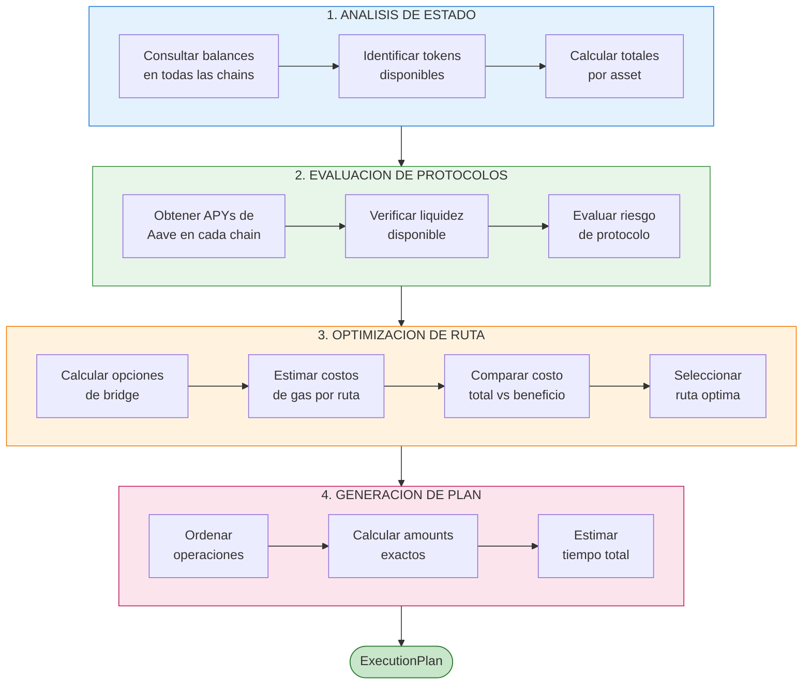
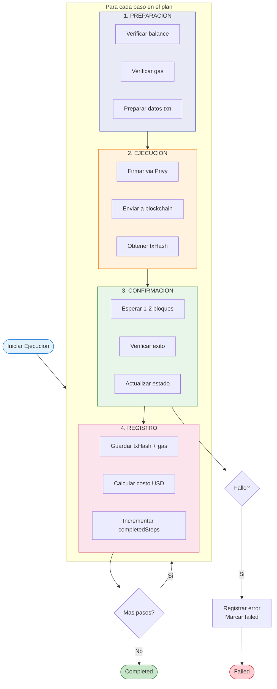
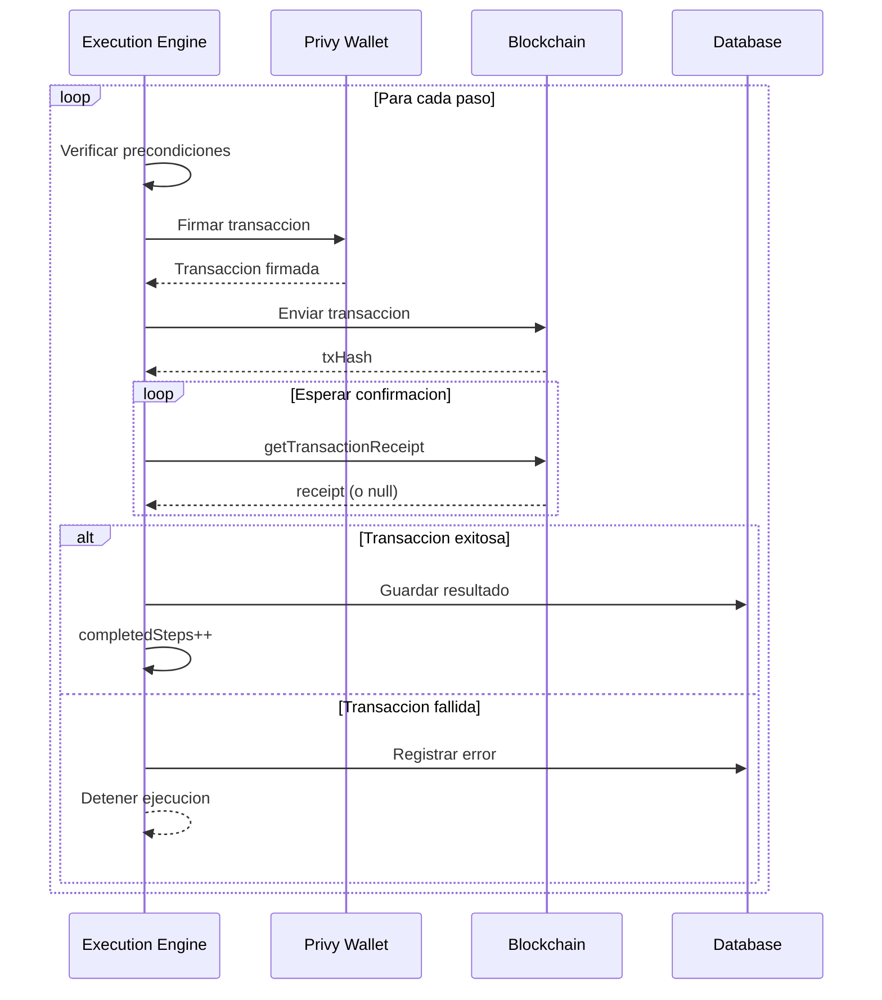

Los Planes de Ejecucion son estrategias detalladas que Pan genera automaticamente para lograr tus intents. Describen exactamente que operaciones se realizaran, en que orden, y con que costos esperados.

## Como Funciona la Planificacion

Cuando creas un intent, Pan no ejecuta inmediatamente. Primero pasa por una fase de planificacion sofisticada:



## Estructura de un Plan de Ejecucion

```json
{
  "strategy": "single-bridge",
  "targetChain": "base",
  "targetProtocol": "aave",
  "expectedApy": 8.52,
  "steps": [
    {
      "type": "bridge",
      "sequence": 1,
      "from": "arbitrum",
      "to": "base",
      "asset": "USDC",
      "amount": "1000",
      "provider": "across",
      "estimatedFee": "1.50",
      "estimatedTime": "2-5 min"
    },
    {
      "type": "deposit",
      "sequence": 2,
      "chain": "base",
      "protocol": "aave",
      "asset": "USDC",
      "amount": "998.50",
      "estimatedGas": "200000",
      "estimatedGasUsd": "0.80"
    }
  ],
  "summary": {
    "totalSteps": 2,
    "estimatedGasUsd": 2.30,
    "estimatedFees": 1.50,
    "estimatedTotalCost": 3.80,
    "estimatedTime": "3-7 min",
    "expectedFinalAmount": "998.50"
  }
}
```

## Tipos de Estrategia

<Info>
  Las estrategias usan nombres internos especificos. Asegurate de usar los nombres correctos en tus integraciones.
</Info>

### direct-deposit

**Cuando se usa:** Los fondos ya estan en la chain con mejor yield.

```
Estado del wallet:
- Base: 1000 USDC
- Mejor APY: Base (8.52%)

Estrategia: direct-deposit
- Solo deposito directo a Aave
- Gas estimado: ~300,000
```

```json
{
  "strategy": "direct-deposit",
  "reasoning": "Funds already on optimal chain",
  "steps": [
    {
      "type": "deposit",
      "chain": "base",
      "protocol": "aave",
      "asset": "USDC",
      "amount": 1000
    }
  ],
  "estimatedGas": 300000,
  "estimatedTime": 30
}
```

### bridge-and-lend

**Cuando se usa:** Los fondos estan concentrados en una chain diferente a la optima.

```
Estado del wallet:
- Arbitrum: 1000 USDC
- Mejor APY: Base (8.52%)

Estrategia: bridge-and-lend
- Bridge Arbitrum -> Base via Across
- Deposito en Aave Base
- Gas estimado: ~450,000
- Fee de bridge: ~0.1%
```

```json
{
  "strategy": "bridge-and-lend",
  "reasoning": "Bridge to chain with best APY",
  "steps": [
    {
      "type": "bridge",
      "fromChain": "arbitrum-sepolia",
      "toChain": "base-sepolia",
      "asset": "USDC",
      "amount": 1000,
      "bridge": "across"
    },
    {
      "type": "deposit",
      "chain": "base-sepolia",
      "protocol": "aave",
      "asset": "USDC",
      "amount": 999
    }
  ],
  "estimatedGas": 450000,
  "estimatedTime": 120
}
```

### multi-bridge-and-lend

**Cuando se usa:** Los fondos estan distribuidos en multiples chains.

```
Estado del wallet:
- Ethereum: 200 USDC
- Arbitrum: 500 USDC
- Base: 300 USDC (ya en destino)
- Mejor APY: Base (8.52%)

Estrategia: multi-bridge-and-lend
- Bridge Ethereum -> Base
- Bridge Arbitrum -> Base
- Deposito consolidado en Aave Base
- Gas estimado: 300,000 + (N x 150,000)
```

```json
{
  "strategy": "multi-bridge-and-lend",
  "reasoning": "Consolidate funds from multiple chains",
  "steps": [
    {
      "type": "bridge",
      "fromChain": "sepolia",
      "toChain": "base-sepolia",
      "asset": "USDC",
      "amount": 200,
      "bridge": "across"
    },
    {
      "type": "bridge",
      "fromChain": "arbitrum-sepolia",
      "toChain": "base-sepolia",
      "asset": "USDC",
      "amount": 500,
      "bridge": "across"
    },
    {
      "type": "deposit",
      "chain": "base-sepolia",
      "protocol": "aave",
      "asset": "USDC",
      "amount": 996
    }
  ],
  "estimatedGas": 600000,
  "estimatedTime": 300
}
```

### simple-withdraw

**Cuando se usa:** Retirar fondos de Aave.

```json
{
  "strategy": "simple-withdraw",
  "reasoning": "Direct withdrawal from Aave",
  "steps": [
    {
      "type": "withdraw",
      "chain": "base-sepolia",
      "protocol": "aave",
      "asset": "USDC",
      "amount": 500
    }
  ],
  "estimatedGas": 250000,
  "estimatedTime": 30
}
```

## Tipos de Pasos

### Bridge

Mueve tokens entre chains usando Across Protocol.

```json
{
  "type": "bridge",
  "from": "arbitrum",
  "to": "base",
  "asset": "USDC",
  "amount": "1000",
  "provider": "across",
  "estimatedFee": "1.50",
  "estimatedTime": "2-5 min",
  "fillDeadline": 7200
}
```

**Campos importantes:**
- `provider`: Siempre `across` (Across Protocol)
- `estimatedFee`: Fee del bridge en USD
- `fillDeadline`: Tiempo maximo para completar (segundos)

### Deposit

Deposita tokens en un protocolo de lending.

```json
{
  "type": "deposit",
  "chain": "base",
  "protocol": "aave",
  "asset": "USDC",
  "amount": "998.50",
  "apy": 8.52,
  "estimatedGas": "200000",
  "estimatedGasUsd": "0.80"
}
```

**Campos importantes:**
- `protocol`: Siempre `aave` actualmente
- `apy`: APY esperado
- `amount`: Cantidad despues de fees de bridge

### Withdraw

Retira tokens de un protocolo de lending.

```json
{
  "type": "withdraw",
  "chain": "base",
  "protocol": "aave",
  "asset": "USDC",
  "amount": "500",
  "estimatedGas": "250000",
  "estimatedGasUsd": "1.00"
}
```

### Swap (Proximo)

Intercambia un token por otro (en desarrollo).

```json
{
  "type": "swap",
  "chain": "arbitrum",
  "fromAsset": "USDT",
  "toAsset": "USDC",
  "amount": "500",
  "provider": "uniswap",
  "estimatedSlippage": "0.1%"
}
```

## Ejecucion del Plan

Una vez generado el plan, Pan ejecuta cada paso en secuencia:



### Diagrama de Secuencia Detallado



## Monitorear Ejecucion

Durante la ejecucion, puedes ver el progreso en tiempo real:

```javascript
const intent = await pan.getIntent(intentId);

console.log('Estado:', intent.status);
console.log('Plan:', intent.executionPlan);
console.log('Resultados:', intent.results);
```

### Respuesta durante ejecucion

```json
{
  "id": "intent_xyz789",
  "status": "executing",
  "executionPlan": {
    "strategy": "single-bridge",
    "steps": [
      {
        "type": "bridge",
        "sequence": 1,
        "status": "completed",
        "txHash": "0x123abc..."
      },
      {
        "type": "deposit",
        "sequence": 2,
        "status": "executing"
      }
    ]
  },
  "results": {
    "completedSteps": 1,
    "transactions": [
      {
        "type": "bridge",
        "txHash": "0x123abc...",
        "chain": "arbitrum",
        "gasUsed": "150000",
        "gasCostUsd": 1.50
      }
    ]
  }
}
```

### Respuesta completada

```json
{
  "id": "intent_xyz789",
  "status": "completed",
  "executionPlan": {
    "strategy": "single-bridge",
    "steps": [
      { "type": "bridge", "sequence": 1, "status": "completed" },
      { "type": "deposit", "sequence": 2, "status": "completed" }
    ]
  },
  "results": {
    "completedSteps": 2,
    "transactions": [
      {
        "type": "bridge",
        "txHash": "0x123abc...",
        "chain": "arbitrum",
        "gasUsed": "150000",
        "gasCostUsd": 1.50
      },
      {
        "type": "deposit",
        "txHash": "0x456def...",
        "chain": "base",
        "gasUsed": "200000",
        "gasCostUsd": 0.80
      }
    ],
    "totalGasUsed": "350000",
    "totalGasCostUsd": 2.30,
    "finalAmount": "998.50",
    "apy": 8.52
  },
  "completedAt": "2024-01-15T10:45:30Z"
}
```

## Optimizacion de Costos

Pan optimiza costos considerando multiples factores:

### Costos de Bridge

```
Bridge fee = base_fee + (amount * percentage_fee)

Ejemplo Across:
- Base fee: ~$0.50
- Percentage: ~0.1%
- 1000 USDC: $0.50 + $1.00 = $1.50 fee
```

### Costos de Gas

```
Gas cost = gas_used * gas_price * eth_price

Ejemplo en Base:
- Gas used: 200,000
- Gas price: 0.001 gwei
- ETH price: $2,500
- Cost: ~$0.50
```

### Decision de Bridge

Pan decide si hacer bridge basandose en:

```
APY_diferencia = APY_mejor_chain - APY_chain_actual
Costo_bridge = fee_bridge + gas_bridge
Tiempo_breakeven = Costo_bridge / (Amount * APY_diferencia / 365)

Si Tiempo_breakeven < 30 dias:
  → Hacer bridge vale la pena
Si no:
  → Depositar en chain actual
```

## Manejo de Fallos

### Durante Bridge

Si un bridge falla:
1. Pan espera hasta `fillDeadline`
2. Si no completa, marca el paso como fallido
3. El intent queda en estado `failed`
4. Los fondos permanecen en la chain origen

```json
{
  "status": "failed",
  "error": {
    "code": "BRIDGE_TIMEOUT",
    "message": "Bridge did not complete within deadline",
    "step": 1
  },
  "results": {
    "completedSteps": 0,
    "failedStep": 1
  }
}
```

### Durante Deposit

Si un deposito falla:
1. Los fondos ya estan en la chain destino
2. Pan intenta diagnosticar el error
3. Puedes reintentar con un nuevo intent

```json
{
  "status": "failed",
  "error": {
    "code": "DEPOSIT_REVERTED",
    "message": "Transaction reverted on chain",
    "step": 2,
    "details": {
      "reason": "Insufficient liquidity in protocol"
    }
  }
}
```

## Verificar Transacciones

Todas las transacciones son verificables on-chain:

```javascript
const intent = await pan.getIntent(intentId);

// Obtener explorers
const explorers = {
  'ethereum': 'https://etherscan.io/tx/',
  'ethereum-sepolia': 'https://sepolia.etherscan.io/tx/',
  'arbitrum': 'https://arbiscan.io/tx/',
  'arbitrum-sepolia': 'https://sepolia.arbiscan.io/tx/',
  'base': 'https://basescan.org/tx/',
  'base-sepolia': 'https://sepolia.basescan.org/tx/'
};

// Mostrar links
intent.results?.transactions?.forEach(tx => {
  const chain = tx.chain;
  const explorer = explorers[chain];
  console.log(`${tx.type}: ${explorer}${tx.txHash}`);
});
```

## Proximos Pasos

<CardGroup cols={2}>
  <Card
    title="Ejecutar Intents"
    icon="play"
    href="/guias/ejecutar-intents"
  >
    Guia practica de ejecucion
  </Card>
  <Card
    title="Monitorear Estado"
    icon="chart-line"
    href="/guias/monitorear-estado"
  >
    Como hacer seguimiento efectivo
  </Card>
  <Card
    title="Manejo de Errores"
    icon="exclamation-triangle"
    href="/guias/mejores-practicas/manejo-errores"
  >
    Estrategias para manejar fallos
  </Card>
  <Card
    title="API de Intents"
    icon="terminal"
    href="/api/intents/crear-intent"
  >
    Referencia del endpoint
  </Card>
</CardGroup>
