## Vision General

```mermaid
flowchart TB
    subgraph L1["Layer 1"]
        ETH["Ethereum<br/>Chain ID: 1<br/>🔷"]
    end

    subgraph L2["Layer 2 Rollups"]
        ARB["Arbitrum One<br/>Chain ID: 42161<br/>🔵"]
        BASE["Base<br/>Chain ID: 8453<br/>🔵"]
    end

    ETH -->|"Hereda seguridad"| ARB
    ETH -->|"Hereda seguridad"| BASE

    style L1 fill:#627eea,stroke:#627eea,color:#fff
    style L2 fill:#e3f2fd,stroke:#1976d2
    style ETH fill:#627eea,stroke:#3c3c3d,color:#fff
    style ARB fill:#28a0f0,stroke:#1a6fb0,color:#fff
    style BASE fill:#0052ff,stroke:#003db3,color:#fff
```



## Chains en Produccion

<CardGroup cols={3}>
  <Card title="Ethereum" icon="ethereum">
    **Mainnet**
    - Chain ID: 1
    - Token nativo: ETH
    - Tipo: L1
  </Card>
  <Card title="Arbitrum One" icon="layer-group">
    **Mainnet**
    - Chain ID: 42161
    - Token nativo: ETH
    - Tipo: L2 Optimistic Rollup
  </Card>
  <Card title="Base" icon="layer-group">
    **Mainnet**
    - Chain ID: 8453
    - Token nativo: ETH
    - Tipo: L2 Optimistic Rollup
  </Card>
</CardGroup>

## Chains en Staging (Testnets)

<CardGroup cols={3}>
  <Card title="Ethereum Sepolia" icon="flask">
    **Testnet**
    - Chain ID: 11155111
    - Faucet: [sepoliafaucet.com](https://sepoliafaucet.com)
  </Card>
  <Card title="Arbitrum Sepolia" icon="flask">
    **Testnet**
    - Chain ID: 421614
    - Faucet: [faucet.arbitrum.io](https://faucet.arbitrum.io)
  </Card>
  <Card title="Base Sepolia" icon="flask">
    **Testnet**
    - Chain ID: 84532
    - Faucet: [faucet.base.org](https://faucet.base.org)
  </Card>
</CardGroup>

## Detalles por Chain

### Ethereum Mainnet

| Propiedad | Valor |
|-----------|-------|
| Chain ID | `1` |
| Nombre RPC | `ethereum` |
| Explorador | [etherscan.io](https://etherscan.io) |
| Tiempo de bloque | ~12 segundos |
| Costo de gas | Alto ($5-50 por tx) |
| Finalizacion | ~15 minutos |

**Contratos Pan:**
```
Wallet Factory: 0x... (pendiente)
```

**Caracteristicas:**
- Mayor seguridad y descentralizacion
- Liquidez mas profunda
- Gas mas costoso
- Recomendado para montos grandes (>$10,000)

### Arbitrum One

| Propiedad | Valor |
|-----------|-------|
| Chain ID | `42161` |
| Nombre RPC | `arbitrum` |
| Explorador | [arbiscan.io](https://arbiscan.io) |
| Tiempo de bloque | ~0.25 segundos |
| Costo de gas | Bajo ($0.10-1 por tx) |
| Finalizacion | ~7 dias (datos a L1) |

**Contratos Pan:**
```
Wallet Factory: 0x... (pendiente)
```

**Caracteristicas:**
- Gas muy economico
- Transacciones rapidas
- Hereda seguridad de Ethereum
- Ideal para la mayoria de operaciones

### Base

| Propiedad | Valor |
|-----------|-------|
| Chain ID | `8453` |
| Nombre RPC | `base` |
| Explorador | [basescan.org](https://basescan.org) |
| Tiempo de bloque | ~2 segundos |
| Costo de gas | Muy bajo ($0.01-0.50 por tx) |
| Finalizacion | ~7 dias (datos a L1) |

**Contratos Pan:**
```
Wallet Factory: 0x... (pendiente)
```

**Caracteristicas:**
- Gas extremadamente bajo
- Desarrollado por Coinbase
- Ecosistema en crecimiento
- Ideal para usuarios nuevos

## Comparativa de Chains


<Info>
  **Base** y **Arbitrum** ofrecen el mejor balance entre velocidad y costo. **Ethereum** es ideal para montos grandes donde la seguridad es prioridad.
</Info>

### Costos de Gas

| Operacion | Ethereum | Arbitrum | Base |
|-----------|----------|----------|------|
| Transferencia simple | $5-15 | $0.10-0.30 | $0.01-0.05 |
| Aprobar token | $10-30 | $0.20-0.50 | $0.02-0.10 |
| Deposito en Aave | $20-60 | $0.30-1.00 | $0.05-0.20 |
| Bridge (envio) | $15-40 | $0.30-0.80 | $0.05-0.15 |

<Note>
Los costos de gas varian segun la congestion de la red. Los valores son estimados.
</Note>

### Velocidad

| Metrica | Ethereum | Arbitrum | Base |
|---------|----------|----------|------|
| Confirmacion inicial | 12s | <1s | 2s |
| Finalizacion soft | 2-3 bloques | 1 bloque | 1 bloque |
| Finalizacion hard | ~15 min | ~7 dias | ~7 dias |

### Recomendaciones por Caso de Uso

| Caso de Uso | Chain Recomendada | Razon |
|-------------|-------------------|-------|
| Depositos pequenos (<$500) | Base | Gas minimo |
| Depositos medianos ($500-$10k) | Arbitrum | Balance gas/seguridad |
| Depositos grandes (>$10k) | Ethereum | Maxima seguridad |
| Trading frecuente | Arbitrum | Velocidad y bajo costo |
| Largo plazo (hodl) | Ethereum | Seguridad |

## Uso en la API

### Especificar Chain Preferida

```typescript
// Depositar preferentemente en Arbitrum
const intent = await pan.lend({
  walletId: 'wallet_123',
  amount: 1000,
  asset: 'USDC',
  preferredChain: 'arbitrum'
});
```

### Bridge Entre Chains

```mermaid
flowchart LR
    subgraph Source["Chain Origen"]
        S1["Base<br/>500 USDC"]
    end

    Bridge["🌉 Across Protocol<br/>~2-10 min"]

    subgraph Dest["Chain Destino"]
        D1["Arbitrum<br/>~499 USDC"]
    end

    Source --> Bridge
    Bridge --> Dest

    style Source fill:#0052ff,stroke:#003db3,color:#fff
    style Dest fill:#28a0f0,stroke:#1a6fb0,color:#fff
    style Bridge fill:#fff3e0,stroke:#f57c00
```



```typescript
// Mover de Base a Arbitrum
const intent = await pan.bridge({
  walletId: 'wallet_123',
  amount: 500,
  asset: 'USDC',
  fromChain: 'base',
  toChain: 'arbitrum'
});
```

### Obtener Balances por Chain

```typescript
const balances = await pan.wallet.getBalances('wallet_123');

// Estructura de respuesta
{
  "balances": {
    "ethereum": [
      { "symbol": "USDC", "balanceFormatted": "1000.00", ... }
    ],
    "arbitrum": [
      { "symbol": "USDC", "balanceFormatted": "500.00", ... }
    ],
    "base": [
      { "symbol": "USDC", "balanceFormatted": "250.00", ... }
    ]
  }
}
```

## Identificadores de Chain

### Para la API

Usa el nombre en minusculas:

```typescript
type ChainName = 'ethereum' | 'arbitrum' | 'base';

// En staging (testnets)
type TestnetChainName = 'ethereum-sepolia' | 'arbitrum-sepolia' | 'base-sepolia';
```

### Chain IDs

Si necesitas los chain IDs para integraciones externas:

```typescript
const CHAIN_IDS = {
  // Mainnet
  ethereum: 1,
  arbitrum: 42161,
  base: 8453,

  // Testnet
  'ethereum-sepolia': 11155111,
  'arbitrum-sepolia': 421614,
  'base-sepolia': 84532
};
```

## Proximas Chains

<Info>
Las siguientes chains estan en evaluacion para futuras versiones:
- **Optimism** - L2 con gran ecosistema DeFi
- **Polygon** - Popular en LATAM
- **Avalanche** - C-Chain con buena liquidez
- **zkSync** - L2 con tecnologia ZK
</Info>

## FAQ

<AccordionGroup>
  <Accordion title="Por que solo 3 chains?">
    Empezamos con las chains que ofrecen:
    - Mayor liquidez en USDC
    - Mejores rendimientos en Aave
    - Bridges confiables (Across Protocol)
    - Infraestructura madura

    Agregaremos mas chains basado en demanda de usuarios.
  </Accordion>

  <Accordion title="Puedo elegir en que chain depositar?">
    Si, puedes usar el parametro `preferredChain` en los intents.
    Sin embargo, Pan optimizara automaticamente si detecta una mejor opcion
    considerando:
    - Donde estan tus fondos actualmente
    - Costos de bridge vs. beneficio de APY
    - Liquidez disponible
  </Accordion>

  <Accordion title="Que pasa si deposito en Ethereum y quiero mover a Arbitrum?">
    Pan maneja esto automaticamente. Si ejecutas un intent de `lend` con
    `preferredChain: 'arbitrum'` pero tus fondos estan en Ethereum, Pan:
    1. Retira de Aave Ethereum (si aplica)
    2. Ejecuta bridge via Across
    3. Deposita en Aave Arbitrum
    Todo en un solo intent.
  </Accordion>

  <Accordion title="Cuanto tiempo toma un bridge?">
    Depende de las chains involucradas:
    - L2 a L2 (Arbitrum ↔ Base): 2-10 minutos
    - Ethereum a L2: 10-30 minutos
    - L2 a Ethereum: Puede tomar hasta 7 dias (retiro oficial)
      pero usamos bridges rapidos que toman minutos
  </Accordion>
</AccordionGroup>
